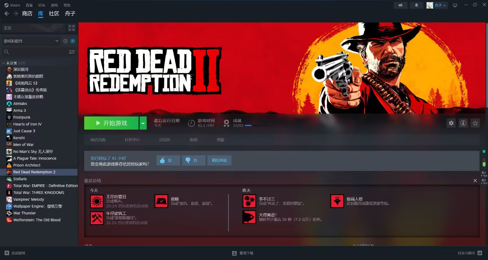
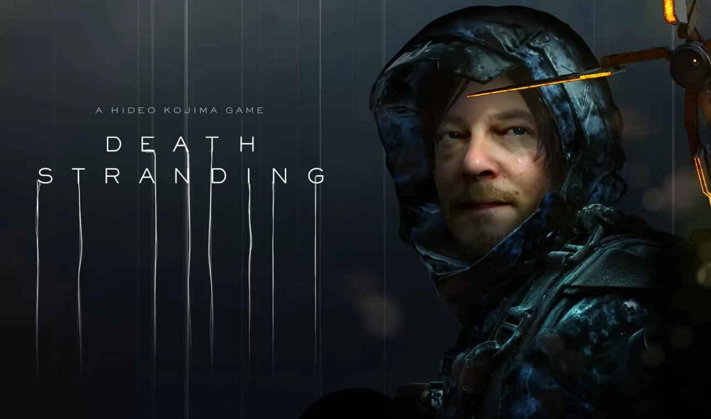

&nbsp;

&nbsp;

&nbsp;

# 光环：士官长合集 HALO: The Master Chief Collection

>该测评摘自QQ空间，写于2025年07月09日

光环：士官长合集

在今天终于是打完了致远星和光环1到光环4的主线内容。在几个月前玩过一段时间，之后不知道为什么没玩了。本来是说期末周打的，但想到要考试，不能花太多时间在游戏上，就换了个我认为不是那么addictive的游戏（纪元1800）玩，虽然好像后者脱离了我的意愿，导致我原本规划的一些复习时间消失了。但言归正传，来稍微写写我对这个游戏的看法。

可以明显地感觉到，光环系列确实很老，但也可以感受到该系列随时代的进步。在玩光环1的时候，虽然画质不太行，但我还是有被惊艳到。没想到这么老的游戏居然有一套完整的载具系统以及ai，有车辆、坦克以及飞行单位。不过玩到后面，特别是光环2到4的时候，会明显发现，游戏内容十分重复，基本都是光环1和致远星做点改动，也只在光环4引入了新的敌人派别，而且直到光环4，冲刺才作为士官长的一项常驻能力。还有一点需要批评的，任务引导做得太烂了，很容易迷路以及不知道如何推进任务。

再谈谈剧情，中规中矩吧，没什么深度，但也没啥槽点。不过这些都是对光环1到光环3和致远星的评价，光环4的剧情实在是槽点太多。据说后面的光环系列也就这么拉胯下来了，挺可惜的。

最后来个结论吧，作为上古fps系列之一，光环确实有亮眼的地方，但是与质量效应系列相比的话，我更喜欢后者，其剧情、战斗以及自由度上比光环系列好。虽然横向比较有劣势，但不影响光环系列早期的优秀。即便是现在，也有一玩的价值，可玩性至少比育碧的罐头强。

&nbsp;

&nbsp;

&nbsp;

# 亚托莉：我挚爱的时光 ATRI -My Dear Moments-

>该测评摘自QQ空间，写于2024年07月19日

“时间流逝吧，你是多么残酷——”

“时间停止吧，你是多么美丽——”

ATRI是一部很优秀的作品。故事中的描写节奏缓慢，但饱含真情。从平日生活中与人物逐渐产生共情，在事件点产生共鸣。有很多泪点，中途有几次想落泪。但是沟槽的剧情设置，在泪点的时候预留时间太短了，或是后续切换太快，没流出来，要出来了又给按回去了。

有三个结局，happy end \ bad end \ true end，true end是hppy end的延续。bad end有点为了bad而bad的意思，结束得很快。但是为了true end你又不得不打bad end。所以建议先打bad end，再打happy end，这样可以紧跟true end。

总之，很好的galgame，值得推荐。

&nbsp;

&nbsp;

&nbsp;

# 荒野大镖客：救赎2 Red Dead Redemption II

>该测评摘自QQ空间，写于2023年11月19日

《荒野大镖客：救赎》，这是一部美国西部的史诗。

我终于在今天通过了主线。

毋庸置疑的杰作，本来想写一些什么，但是太多了，我无法描述这部作品的魅力，真的，far beyond my words.

&nbsp;

&nbsp;

&nbsp;

# 死亡搁浅 Death Stranding

>该测评摘自QQ空间，写于2023年11月06日

它不只是一款游戏，也是一部叙事极好的交互式电影。

我没有想到我会沉浸在一款送快递的游戏中，而且在主线的推进过程中未曾感到无聊。

小岛秀夫他那惊人的叙事能力让我赞叹不已，搭配上富有深意的镜头语言，出人意料的剧情结构安排和奇幻的故事，给予了我很好的游玩体验。

之后等到时间充裕，我可能也会体验一次底特律：我欲成人这款交互式游戏，希望他能给我一样或是更好的游戏体验。另外也希望死亡搁浅2能够早日出来，但是冰气时代2应该先出吧。突然感觉又有很多游戏可以玩了。