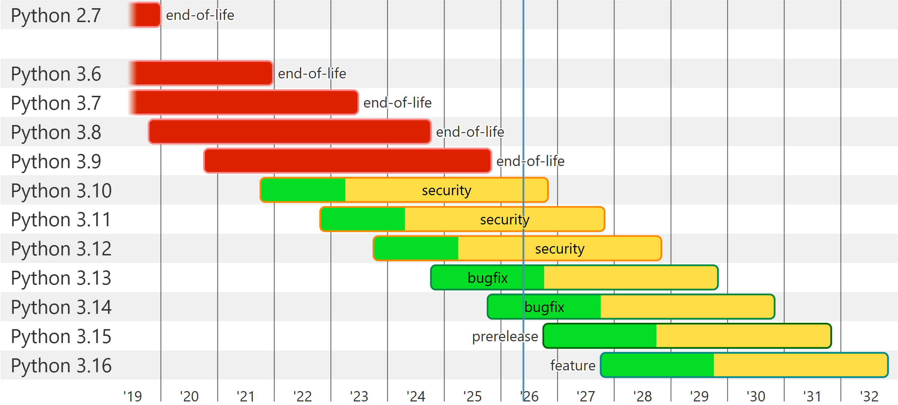

<style>
p {
  line-height: 1.5;
}
</style>

>该笔记主要是随意记录一些我在模拟离子阱中一些操作所使用的代码，作为学习资料，也作为以后开展模拟的资源。
>
>代码均采用python语言编写。
>
>一些琐碎的说明还是交给Gemini 🤖来做吧，我就随便写点文字。

# 第零章 准备

写代码的第一步，清点要用什么库。

这里不会卖关子，直接给出所需库。

```
pip install numpy qutip matplotlib scipy
```

各个库的作用由Gemini来说明：

>NumPy 是 Python 科学计算的核心库。
>
>&emsp;&emsp;作用：提供高性能的多维数组（ndarray）对象，以及对这些数组进行操作的线性代数、傅里叶变换等工具。
>
>&emsp;&emsp;在量子物理中，它常用于处理哈密顿量矩阵或状态矢量的基础运算。
>
>QuTiP (Quantum Toolbox in Python) 是专门用于模拟量子系统动力学的开源库。
>
>&emsp;&emsp;作用：提供了量子对象（Qobj）、演化求解器（如 mesolve）、算符运算（相干态、湮灭算符等）。
>
>&emsp;&emsp;它是量子光学和量子信息科研人员的必备工具。
>
>Matplotlib 是 Python 最基础的绘图库。
>
>&emsp;&emsp;作用：用于生成高质量的 2D 和 3D 图表（如能级图、布洛赫球演化图、概率分布图等）。
>
>&emsp;&emsp;pyplot 模块提供了类似 MATLAB 的绘图接口。
>
>SciPy 是基于 NumPy 的科学计算工具包，包含大量物理/工程常用算法。
>
>&emsp;&emsp;constants 模块内置了精确的物理常量：
>
>&emsp;&emsp;- hbar: 约化普朗克常数 (h / 2π)
>
>&emsp;&emsp;- atomic_mass: 原子质量单位 (u 或 amu)
>
>&emsp;&emsp;- pi: 圆周率 π

但其实这并不应该是第一步，第一步是确定所需库的版本，不然可能与 *祖传代码* 不兼容，导致很多东西需要自己重新修改😓

所以一定要先问好师兄师姐的 *（可能也是师兄师姐的师兄师姐的，也可能，哎就不套娃了）* 库版本口牙！但其实一般是发现了不兼容才去问的🐶

如何下载特定版本的库呢？运行以下代码：

```
pip install qutip==4.7.6   #此处假设需要更换qutip库，所需版本是4.7.6 
```

然后你可能发现：报错啦👻

这是因为有些低版本的库可能只兼容低版本的python，所以你可能需要重新下个低版本的编译器。例如4.7.6版本的qutip就不兼容3.13.7版本的python编译器，你只能回退到3.12.10版本才安装 *（别问我怎么知道的）*。如何选择合适的python版本也是一个问题，最好选择在版本周期维护周期内的。不必寻求最新的，因为适配最新版的库可能还没更新，选择稍旧一些但没那么旧的版本就行。以下图所示情况为例，推荐选择3.12版本。

